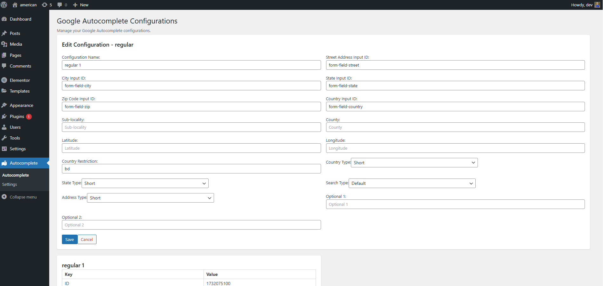
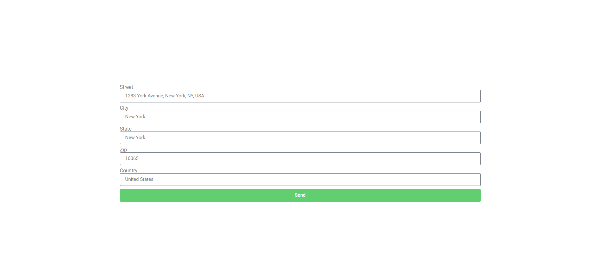

# Google Address Autocomplete WordPress Plugin

The **Google Address Autocomplete Plugin** is a WordPress plugin designed to integrate Google's Address Autocomplete functionality seamlessly into WordPress forms. The plugin allows administrators to configure multiple autocomplete setups and dynamically map form fields to address components like street address, city, state, zip code, and country.

## Features

- Integrates Google's Address Autocomplete API.
- Allows multiple configurations with dynamic field mapping.
- Supports regular and WooCommerce-specific autocomplete setups.
- Includes advanced field options such as latitude, longitude, and country restrictions.
- Fully customizable address formats and configurations.

## Technology Stack

- **Framework**: React (using Vite for development)
- **Styling**: Tailwind CSS
- **Language**: TypeScript
- **Build Tool**: Vite

## Installation

1. Clone the repository or download the `.zip` file.
2. Upload the plugin folder to the `/wp-content/plugins/` directory.
3. Activate the plugin from the WordPress admin panel.

## Usage

### 1. Add a Configuration

- Navigate to the plugin's configuration page in the WordPress admin dashboard.
- Click on "Add New Configuration."
- Fill in the following details:
  - **Street Address ID**
  - **City ID**
  - **State ID**
  - **Zip Code ID**
  - **Country ID**
  - Additional fields like latitude, longitude, and country restrictions.

### 2. Map Address Components

For each configuration, map the Google Address components (e.g., street_number, locality) to the corresponding form field IDs.

### 3. Save and Use

- Save the configuration.
- The autocomplete functionality will automatically initialize for the configured form fields on the frontend.

## Configuration Fields

| Field                   | Description                                                                 |
| ----------------------- | --------------------------------------------------------------------------- |
| **Street Address ID**   | ID of the field for the street address.                                     |
| **City ID**             | ID of the field for the city.                                               |
| **State ID**            | ID of the field for the state or province.                                  |
| **Zip Code ID**         | ID of the field for the postal/ZIP code.                                    |
| **Country ID**          | ID of the field for the country.                                            |
| **Latitude**            | (Optional) Field for storing latitude coordinates.                          |
| **Longitude**           | (Optional) Field for storing longitude coordinates.                         |
| **Country Restriction** | (Optional) Restrict address search to specific countries (comma-separated). |

## Settings Page

The plugin includes a settings page where you can configure:

1. **Google API Key**: Provide your Google Maps API key.
2. **Language**: Set the language for address suggestions.
3. **Clear Log**: Enable or disable logging of API requests.

## Development

### Prerequisites

- Node.js installed on your system.
- Clone the repository.

### Steps

1. Navigate to the `admin` directory.
2. Run `npm install` to install dependencies.
3. Use `npm run dev` to start the development server.
4. Use `npm run build` to build the plugin for production.

## Screenshots

1. **Admin Configuration Page**
   

2. **Frontend Address Autocomplete**
   

## Contributing

Feel free to fork this repository and submit pull requests. For major changes, please open an issue to discuss what you'd like to change.

## License

This plugin is licensed under the [MIT License](LICENSE).

## Support

For support, contact us via [WhatsApp](https://api.whatsapp.com/send/?phone=8801767591988) or [email](mailto:nishatbd33@gmail.com).
